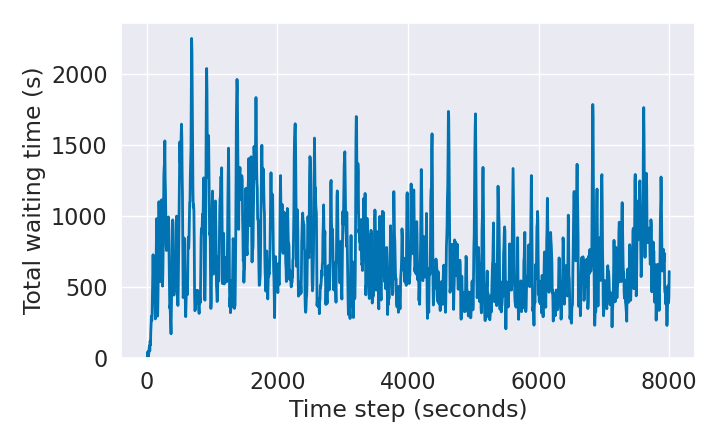
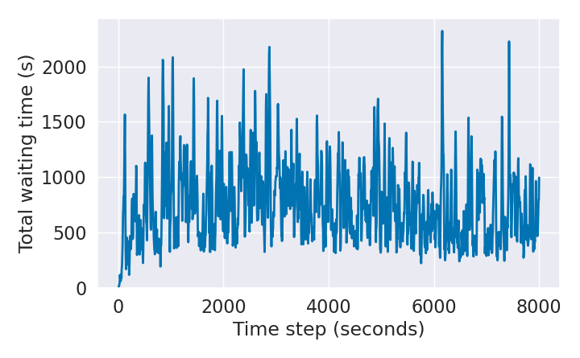
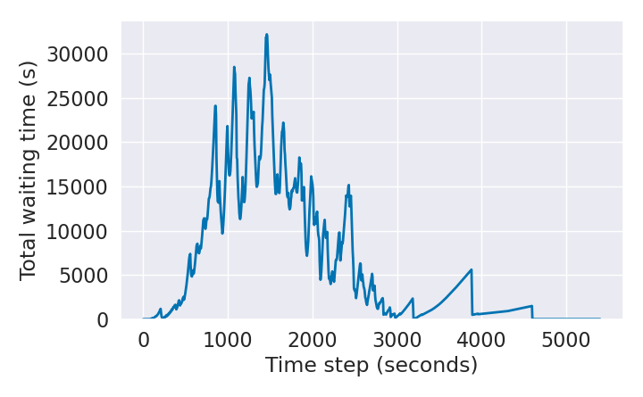
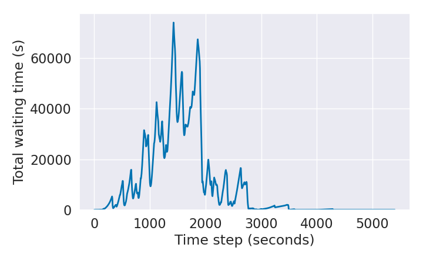

## Код

Код лежит в папке sumo_rl/agents

P.s. импорты могут не найтись, если запускать python без -m.

## Результаты

Картинки в папке

Результаты Q-Learning, как и ожидалось, примерно одинаковы

#### Default Q-Learning:

#### Our Q-Learning:

Результаты DQN интереснее

#### Default DQN (SB3):

У DQN c нашими оптимизациями выше средняя загрузка, но видимо быстрее сходимость к нулю

#### Our DQN:

